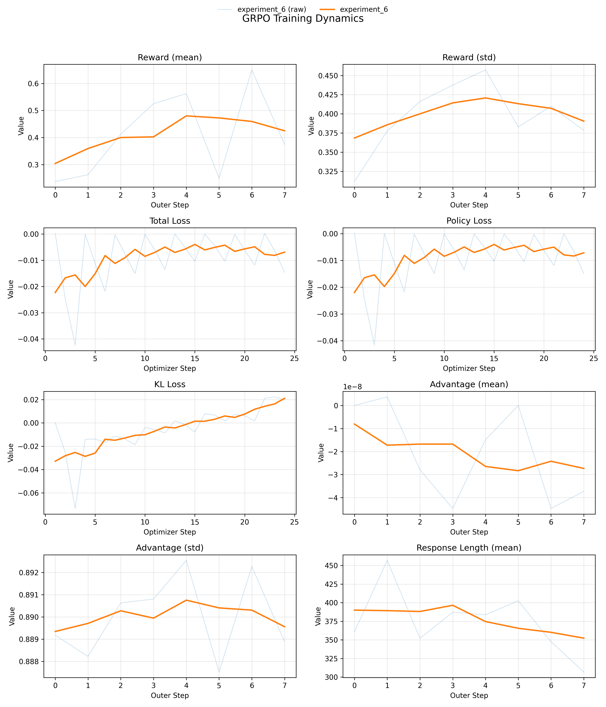

# RLVR GRPO Notebook Summary

This folder contains `rlvr.ipynb`, a from-scratch implementation of **Reinforcement Learning from Verifiable Rewards (RLVR)** using **GRPO** on the MATH-500 dataset with the Qwen2.5-0.5B-Instruct model.
This is a toy experiment and uses only training data; there is no held-out test or evaluation split in the notebook.

## What the Notebook Does
- Downloads the MATH-500 test split and formats each problem into a chat prompt that requires a final `\\boxed{...}` answer.
- Tokenizes prompts using the model's chat template and prepares PyTorch-ready tensors.
- Loads Qwen2.5-0.5B-Instruct, freezes base parameters, and applies **LoRA** adapters to the last 3 transformer blocks.
- Builds a **reference model** (frozen) for KL regularization.
- Implements GRPO with token-level policy ratio clipping, reward normalization to advantages, and KL penalty with optional entropy term.
- Generates rollouts with the old policy and computes rewards via a boxed-answer matcher.
- Adds **dynamic sampling** (DAPO-style): skips prompt groups with near-zero reward variance.
- Trains with gradient accumulation and curriculum sampling over MATH difficulty levels.
- Logs metrics to TensorBoard and provides a paper-style plotting utility.

## Key Components
- `LoRALayer`, `LinearWithLoRA`: minimal LoRA implementation.
- `Trainer`: rollout generation, advantage computation, and GRPO optimization loop.
- `GRPOLoss`: policy loss, KL penalty, and entropy computation.
- `CurriculumSampler`: increases max difficulty level over epochs.
- Plotting utilities for reward/loss/advantage/length dynamics.

## Outputs
- TensorBoard logs under `experiments/experiment_*`.
- Plots for reward, loss, KL, advantage, and response length trends.

## Figures
The plot summarizes training dynamics over outer and optimizer steps. Reward mean rises early and then stabilizes, reward variance narrows, and response length trends downward, which indicates reduced verbosity. KL remains small while trending up, suggesting controlled drift from the reference model.

