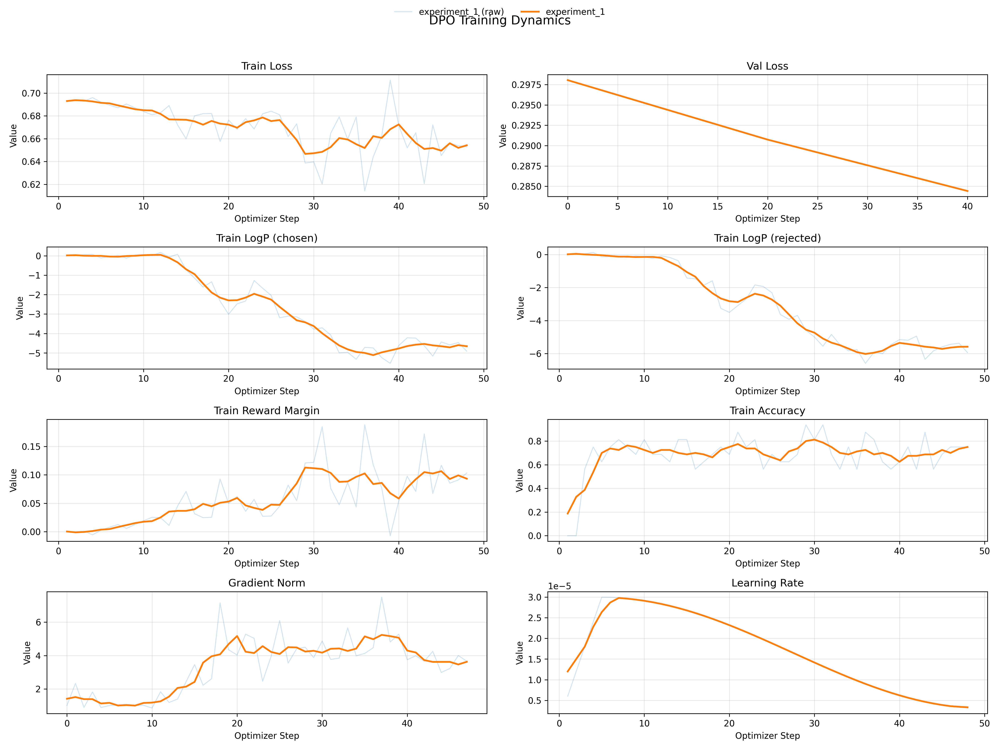

# Direct Preference Optimization (DPO)

This notebook implements DPO from scratch on a small Qwen2.5 model and walks through the full training loop end‑to‑end.

What’s inside
1. **Model setup**
   - Loads `Qwen/Qwen2.5-0.5B-Instruct` with `AutoModelForCausalLM`.
   - Builds a **frozen reference model** as a deep copy of the policy model.
2. **Lightweight LoRA (manual)**
   - Implements a minimal LoRA wrapper (`LoRALayer`, `LinearWithLoRA`).
   - Replaces the last `n` transformer blocks’ linear layers with LoRA‑augmented versions.
3. **Custom DPO training loop**
   - Explicit computation of policy vs reference log‑probs.
   - Implements the DPO objective using `logsigmoid` over log‑ratio differences.
   - Logs metrics like `loss`, `logp_chosen`, `logp_rejected`, and `reward_margin`.
4. **Custom collation and masking**
   - Pads sequences using `pad_sequence`.
   - Builds `attention_mask` (non‑pad) and **response‑only masks** to isolate completion tokens.
   - Supports chosen/rejected pairs in each batch item.
5. **DataLoader + optimizer wiring**
   - Uses `AdamW` with a small learning rate.
   - Manually runs a training loop with periodic validation logging.

Current training configuration (from the notebook)
1. **Base model**: `Qwen/Qwen2.5-0.5B-Instruct`
2. **LoRA**: last `n` blocks (`n_last_blocks=3`), `rank=32`, `alpha=16`, `A ~ N(0, 0.02)`, `B = 0`
3. **DPO beta**: `0.1`
4. **Optimizer**: `AdamW`, `lr=1e-4`, `weight_decay=0.0`
5. **Grad clipping**: `max_norm=1.0`
6. **Mixed precision**: `autocast(..., dtype=torch.bfloat16)`
7. **LR scheduler**: linear warmup + cosine decay to a 10% minimum
8. **Batching**: token‑budget sampler, train budget `4096`, val budget `8192`
9. **Accumulation**: `gradient_accumulation_steps=16`, `optimizer_steps=50`, `max_steps=800`
10. **Validation**: first `100` samples
11. **Logging**: TensorBoard to `experiments/{experiment_name}` with DPO metrics

Files
1. Notebook: `post-training/dpo/dpo.ipynb`

Figures
1. `post-training/dpo/figures/dpo_training_dynamics_latest.png`

Notes

The training dynamics figure summarizes DPO optimization across multiple signals. The top row shows train and validation loss; both trending down indicates stable learning and that the preference objective is being optimized rather than diverging. The validation curve is typically smoother because it aggregates across the held‑out subset.

The middle row shows `logp_chosen` and `logp_rejected`. As training progresses, the chosen log‑probabilities improve relative to rejected ones, which should translate into an increasing reward margin. If both curves move downward together, it usually means the model is getting more confident in its relative ordering rather than absolute likelihood.

The bottom row highlights the reward margin and accuracy, along with gradient norm and the learning rate schedule. Rising reward margin and accuracy indicate the policy is increasingly preferring the chosen responses. The gradient norm staying within a narrow range suggests clipping is stabilizing optimization, and the LR plot confirms warmup followed by cosine decay to a 10% floor.

Note: in the current runs the **train loss starts near 0.693** (as expected when the policy is close to the reference), but **validation starts lower**. This is under review.
