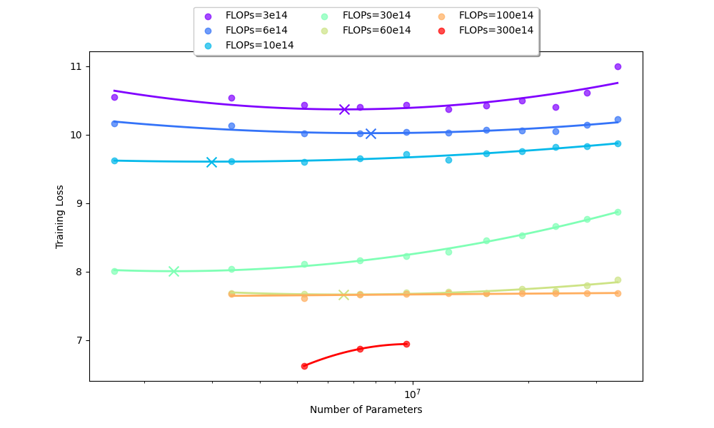
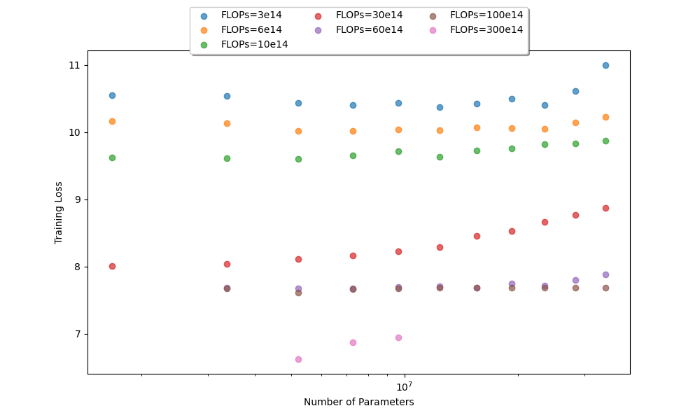
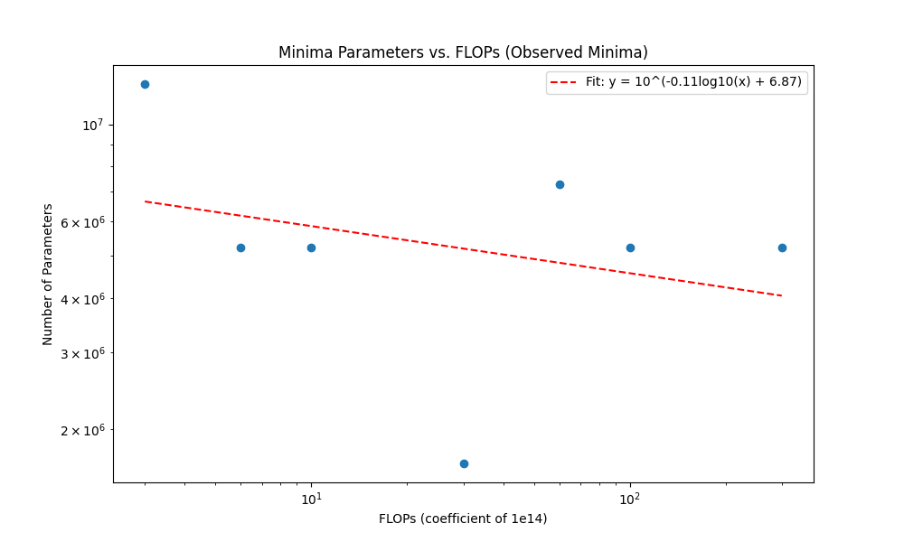
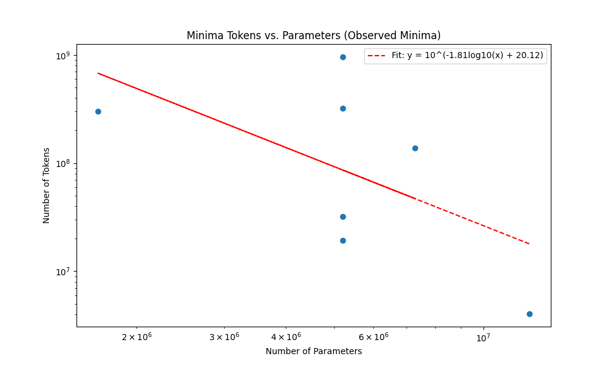
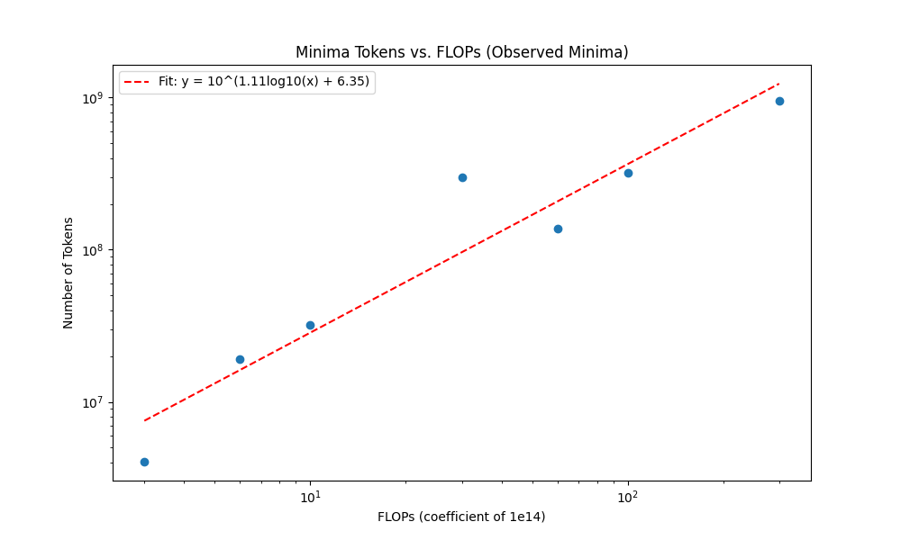

# Scaling Laws

This folder analyzes scaling behavior across compute, parameters, and tokens.

## What Is Implemented
- Loading cached experiment results from `data/` binaries.
- Plotting reference scaling curves for comparison.
- Interpreting scaling trends to guide model sizing.

## Notebooks
- `scaling_laws.ipynb`: produces scaling plots and summarizes observations.

## Figures

